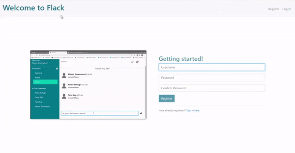

# Flack

A Slack like online messaging service


[](https://shields.io/) [](https://shields.io/) [](https://shields.io/) [](https://shields.io/) [](https://shields.io/) [](https://shields.io/) 
[](https://www.heroku.com/) 


## Demo
[](https://flack-ap.herokuapp.com/)


## Summary
[Flack](https://flack-ap.herokuapp.com/) is a messaging platform like [Slack](https://slack.com/) that allows users to message in real time. Current features includes registering an account, adding or removing message channels, adding or removing users to channels and sending messages in desired channels. For messaging, [Flask-SocketIo](https://flask-socketio.readthedocs.io/en/latest/) library is used. 

## Files Structure
```bash
Flack
├── config.py
├── flack
│   ├── application.py
│   ├── forms.py
│   ├── __init__.py
│   ├── models.py
│   ├── static
│   │   ├── images
│   │   │   ├── demo.gif
│   │   │   ├── favicon-people-arrows.ico
│   │   │   └── man-silhouette-profile-7.png
│   │   ├── scripts
│   │   │   ├── chat.js
│   │   │   ├── lib.js
│   │   │   └── socket.js
│   │   └── styles
│   │       ├── chat.css
│   │       └── layout.css
│   └── templates
│       ├── chat.html
│       ├── helper.html
│       ├── index.html
│       ├── layout.html
│       ├── login.html
│       └── temp.html
├── Procfile
├── README.md
└── requirements.txt

```
## File descriptions
* ```/flack```: the main app module
* ```application.py```: the main application file containing the logic for registering, login, logout, and other API calls such as adding/removing channels.
* ```forms.py```: contains the classes for registration form and login in form which uses the Flask-WTForms library
* ```models.py```: Uses Flask SQLAlchemy to abstract away the database tables and there relationships. Models include User, Channel, and Message.
* ```/templates```: contains all the HTML files to render different views
* ```/script```: contains all the JavaScript files to run the client side code
* ```/styles```: contains all the CSS files for styling
* ```requirements.txt```: contains all the Python packages installed for this project and also this file is required for Heroku
* ```Procfile```: a file required for heroku.


## Usage
### Running the app:
[Use this link to run the live app directly](https://flack-ap.herokuapp.com/)

### Cloning and editing
* After cloning, replace the secret key (i.e modify the line ```SECRET_KEY = os.environ.get('SECRET_KEY')```) and the Database URL (i.e the line ```SQLALCHEMY_DATABASE_URI = os.environ.get('DATABASE_URL')```) in ```config.py``` with your own values. 


## Feature to add in future:
   - Add private messaging between users. Use the sid stored in the db
   - Allow uploading user avatars
   - Add warning popup for when deleting a channel
   - Restrict only a small amount of messages to be displayed at a time and only when users asks for it then display more.
   - Only keep the latest 100 messages in the database.
   - Cap on the maximum channels that can be created
   - Add users account setting
   - Improve the UI
  


## License
MIT License

Copyright (c) 2020 Shamsuddin Rehmani

Permission is hereby granted, free of charge, to any person obtaining a copy
of this software and associated documentation files (the "Software"), to deal
in the Software without restriction, including without limitation the rights
to use, copy, modify, merge, publish, distribute, sublicense, and/or sell
copies of the Software, and to permit persons to whom the Software is
furnished to do so, subject to the following conditions:

The above copyright notice and this permission notice shall be included in all
copies or substantial portions of the Software.

THE SOFTWARE IS PROVIDED "AS IS", WITHOUT WARRANTY OF ANY KIND, EXPRESS OR
IMPLIED, INCLUDING BUT NOT LIMITED TO THE WARRANTIES OF MERCHANTABILITY,
FITNESS FOR A PARTICULAR PURPOSE AND NONINFRINGEMENT. IN NO EVENT SHALL THE
AUTHORS OR COPYRIGHT HOLDERS BE LIABLE FOR ANY CLAIM, DAMAGES OR OTHER
LIABILITY, WHETHER IN AN ACTION OF CONTRACT, TORT OR OTHERWISE, ARISING FROM,
OUT OF OR IN CONNECTION WITH THE SOFTWARE OR THE USE OR OTHER DEALINGS IN THE
SOFTWARE.
    
